# Classroom-Aid : Microsoft Engage Mentorship 2021
The working demo of the project can be accessed from here [Classroom-Aid](https://classroomaid.herokuapp.com/).

**LOGIN CREDENTIALS FOR THE DEPLOYED APP:**

**STUDENT:**  

              Email: student1@gmail.com

              Password: student1
            
**FACULTY:**

               ID: 113

               Password: faculty1
            
**ADMIN :**

              Username: mahima

              Password: mahima

# Aim Of The Project 
* A one-stop, central destination for tools which aim to empower the learners and their facilitators.
It assists students as well as educators by providing them with space for schedules and links to eliminate confusion and chaos, thus saving time and making them organized.
On this portal the admins  can register, add , delete or change student as well as teachers' details.

* Since the teachers can upload links for their scheduled classes, it instills confidence in the students  as they can plan their day at a glance and on one click they can join in the classes as well.

# Tech-Stack Used
This is a Web based Application developed using :

* PHP as a Host Language,
* MySql for database, 
* HTML, CSS and JavaScript for front-end developement.

# Instructions: How to Run

1.After you finish downloading the project, unzip the project file and head over to your XAMPP directory.

2.There you’ll find a folder named “htdocs”.

3.Inside the “htdocs” folder, paste the project folder (not the .zip one, but the extracted one).

4.Open your favorite browser; Google Chrome recommended.

5.Then, go to URL “http://localhost/phpmyadmin“.

6.Create a Database with a name that is provided inside the “LOGIN DETAILS.txt”.

7.Click on the “Import” tab and choose the database file (.sql) which is provided under the folder naming “DATABASE”.

**8.In "database.php" file uncomment localhost database connection and comment the remote connection.**

9.After setting up all these, go to URL “http://localhost/[ PROJECT_FOLDER_NAME ]/“

10.All the login details are provided inside the project folder in “LOGIN DETAILS.txt”.

# Available Features:
* Landing Page
* About Section
* Contact Section
* Student registration
* Students Dashboard
* Faculty Dashboard
* Admin Dsshboard
* Post Queries
* Manage Queries
* Schedule class and add class links
* Modify class schedule
* Edit/Delete Student
* Edit/Delete Faculty
* Add new student
* Add new faculty 
* Logout feature for student/faculty/admin.

# LANDING PAGE
* Displays the about section, contact section and regsiter now feature.
* The navigation bar consists of home, about, student registration, login and contact fields for easy access.
* A scroll back-to-top-button is also added for quick navigation.

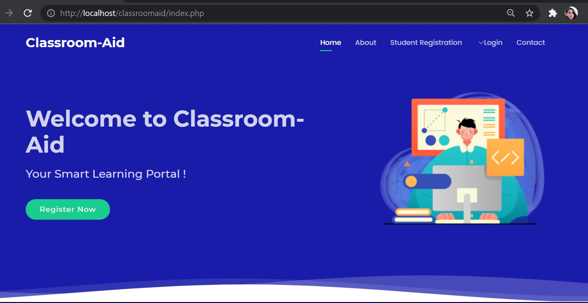

# STUDENT SECTION
**STUDENT LOGIN**

Students can login to the portal using their email-id and password.

 
 
**STUDENT PROFILE**

Students can view their information stored in their institution's database.

 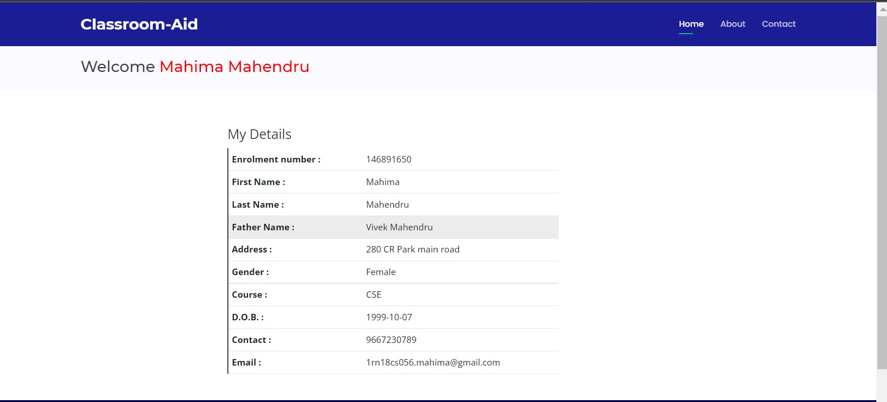
 
**STUDENT CLASS-SCHEDULE**

Students can view the upcoming classes and access the class links with ease in an organised manner.

They can see the class timings, subect, description and link to join class.

 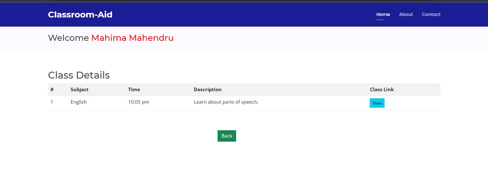
 
 
# FACULTY SECTION
**FACULTY LOGIN**

* Faculty can login to the portal using their id and password.

 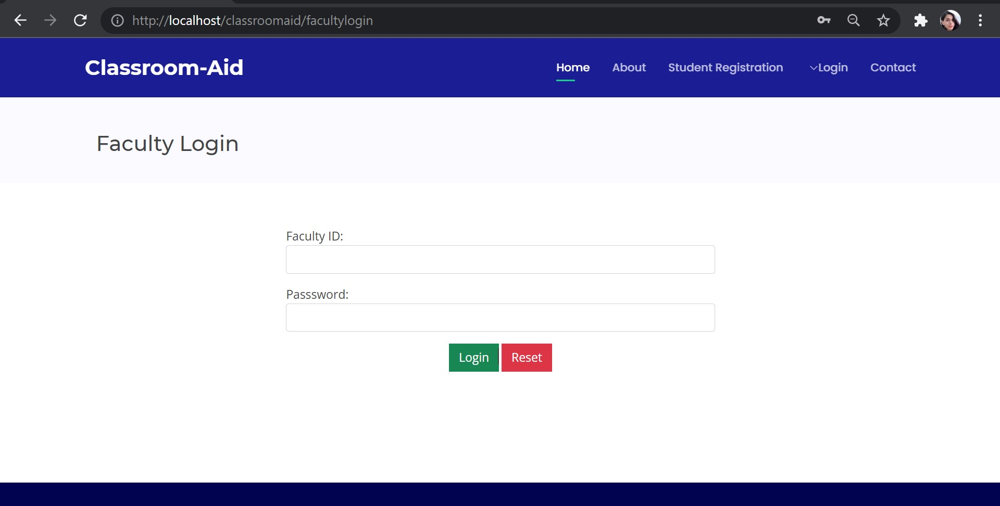
 
**FACULTY PROFILE**

* Faculty can view their information stored in the institution's database.

 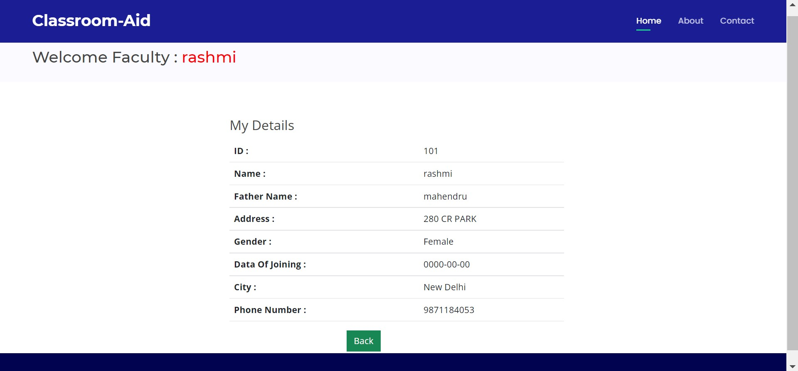
 
**FACULTY CAN ADD/DELETE/EDIT CLASS SCHEDULE**

* Students can view the upcoming classes and access the class links with ease in an organised manner.

* They can see the class timings, subect, description and link to join class.

 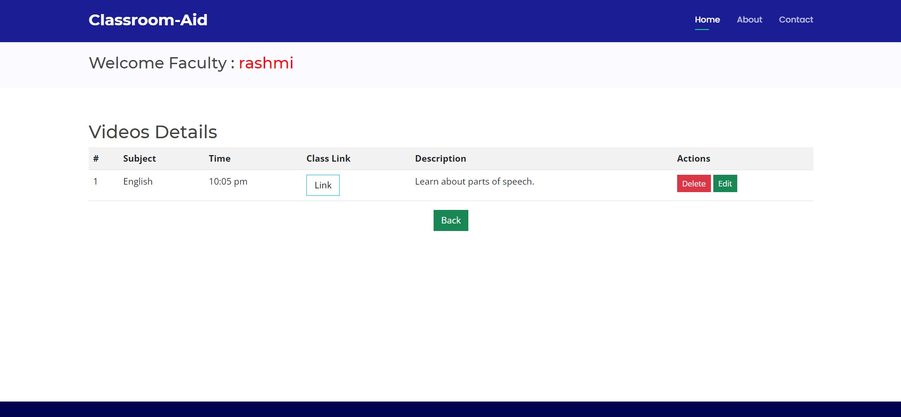
 
 
 # ADMIN SECTION
**ADMIN LOGIN**

* Students can login to the portal using their email-id and password.

 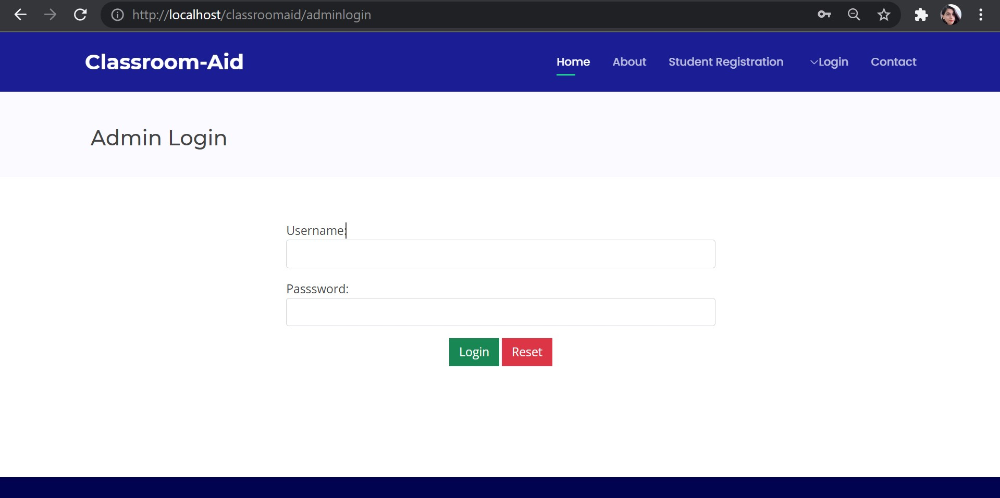
 
**ADMIN DASHBOARD**

* Students can view their information stored in their institution's database.

 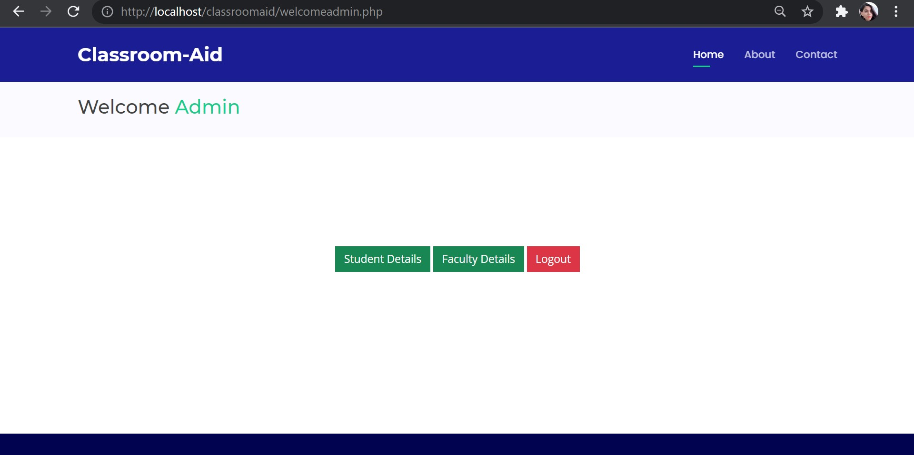
 
**ADMIN ADD/VIEW/EDIT/DELETE STUDENT**

* Admins can view the registered students, add new students,edit student details and delete from database.

 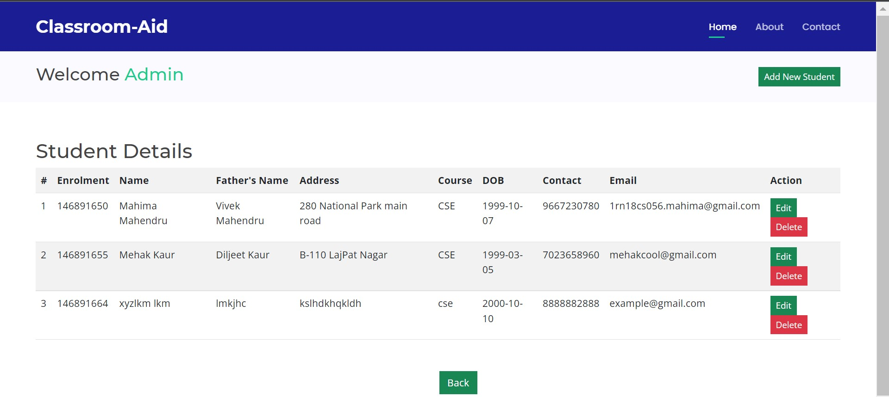
 
 **ADMIN ADD/VIEW/EDIT/DELETE FACULTY**
 
 * Admins can view the faculty members, add new members,edit faculty details and delete from database.

 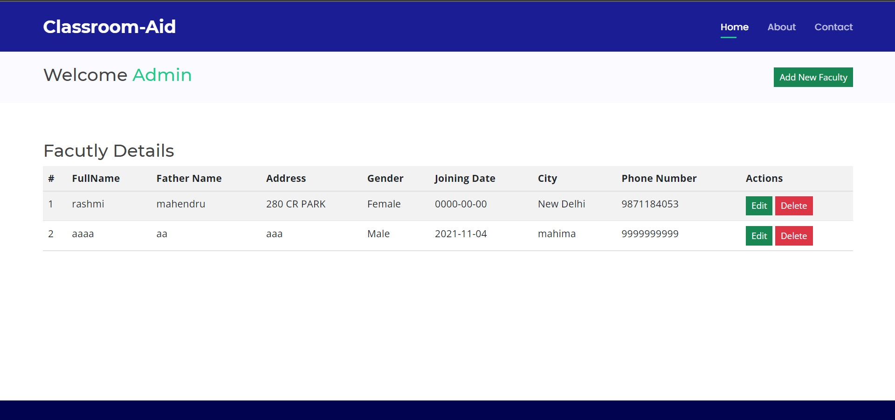
 
  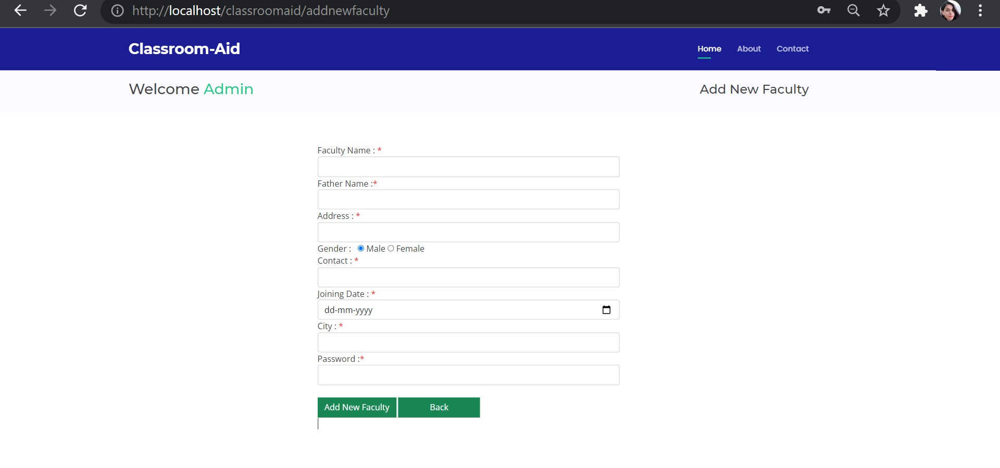

 

 

 

 
