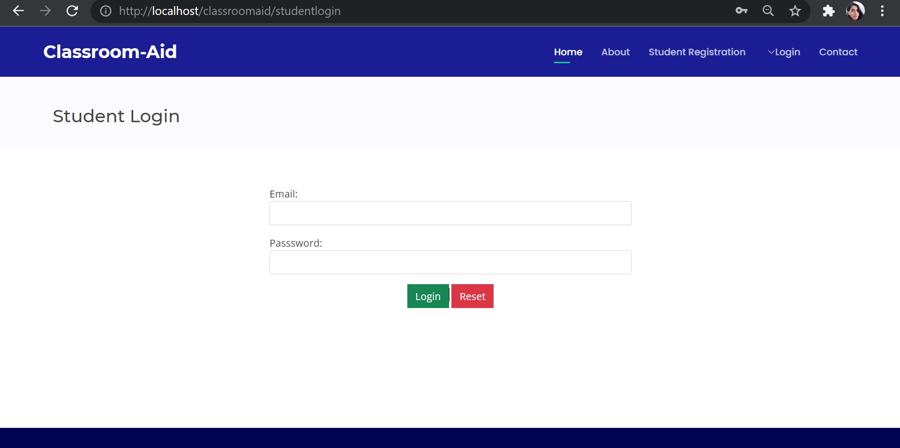

# Classroom-Aid : Microsoft Engage Mentorship 2021

This is a Web based Application developed using PHP as a Host Language, MySql for database, HTML, CSS and JavaScript for front-end developement.

Database for the Application is in "DATABASE" folder. It can be imported to your localhost(phpMyAdmin) or any other servers.
Also configure the "connec.php" to set up the necessary connections with the database.

More features are yet to be developed and implemented. Till then, Happy Coding :)

**HOME**

**HOME (CNTD.)**

**CONTACT US**

**SIGNUP**

# Instructions: How to Run
1.After you finish downloading the project, unzip the project file and head over to your XAMPP directory.

2.There you’ll find a folder named “htdocs”.

3.Inside the “htdocs” folder, paste the project folder (not the .zip one, but the extracted one).

4.Open your favorite browser; Google Chrome recommended.

5.Then, go to URL “http://localhost/phpmyadmin“.

6.Create a Database with a name that is provided inside the “LOGIN DETAILS.txt”.

7.Click on the “Import” tab and choose the database file (.sql) which is provided under the folder naming “DATABASE”.

8.After setting up all these, go to URL “http://localhost/[ PROJECT_FOLDER_NAME ]/“

9.All the login details are provided inside the project folder in “LOGIN DETAILS.txt”.

# Available Features:
* Landing Page
* About Section
* Contact Section
* Student registration
* Students Dashboard
* Faculty Dashboard
* Admin Dsshboard
* Post Queries
* Manage Queries
* Schedule class and add class links
* Modify class schedule
* Edit/Delete Student
* Edit/Delete Faculty
* Add new student
* Add new faculty 
* Logout feature for student/faculty/admin.

# STUDENT SECTION
    **STUDENT LOGIN**
      
 
 
